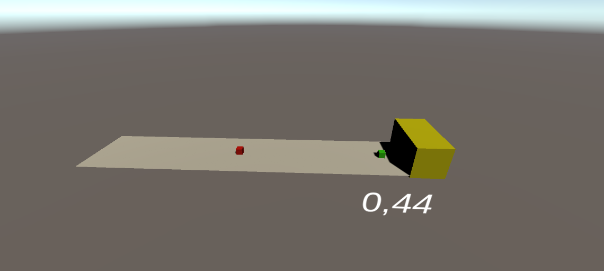

# Machine Learning Jumper Exercise Tutorial

## Inhoudsopgave

1. [Inleiding](#1.-inleiding)
2. [Benodigdheden](#2.-benodigdheden)
3. [Opzet](#3.-opzet)
4. [Objecten](#4.-objecten)
5. [Scripts](#5.-scripts)
6. [Beloningsysteem](#6.-beloningsysteem)
7. [Training](#7.-training)

## 1. Inleiding

De jumper oefening bestaat uit een speler en auto's die op de speler komen afgereden. Het is de bedoeling dat de speler de auto's ontwijkt door te springen. Als de speler de auto aanraakt, krijgt hij minpunten. De speler wordt getraind om de auto's te ontwijken. De auto's hebben altijd een variabele snelheid. Dit zorgt ervoor dat het spel nog moeilijker wordt voor de speler. In deze tutorial wordt uitgelegd hoe dit project in elkaar zit. Alle objecten, scripts en instellingen worden beschreven. De tutorial legt uit hoe het mogelijk is om deze oefening te reproduceren. Het project en de documentatie is gemaakt door Bram Van Cronenburg en Kristof De Winter.

| Naam                | Studentnummer |
|:-------------------:|:-------------:|
| Kristof De Winter   | s106749       |
| Bram Van Cronenburg | s109544       |

## 2. Benodigdheden

De benodigde programma's om dit project te maken zijn [Visual Studio Community](https://visualstudio.microsoft.com/vs/community/) en [Unity](https://store.unity.com/download). Dit project is gemaakt in Unity versie 2019.4.12f1. Om de agent te trainen wordt [ML-Agents](https://github.com/Unity-Technologies/ml-agents/releases) gebruikt. De versie van ML-Agents die wordt gebruikt is 1.0.5.

[Python](https://www.python.org/downloads/) is vereist om de agent te laten trainen. De aanbevolen versie van Python is 3.8.1 of hoger. Het is optioneel om [Anaconda](https://www.anaconda.com/) of [Miniconda](https://docs.conda.io/en/latest/miniconda.html) te installeren, dit zorgt ervoor dat de training kan worden uitgevoerd in een afgezonderde omgeving.

## 3. Opzet

De rode kubus is de auto die de speler moet ontwijken. Deze auto heeft een variabele snelheid en kan enkel vooruit bewegen. De roze kubus is een reward, deze heeft dezelfde eigenschappen als een auto. Het verschil tussen een auto en een reward is dat de rewards punten geven en de auto's minpunten geven als de speler deze aanraakt.

De gele rechthoek is de object destroyer, deze zorgt ervoor dat de auto's en rewards die de speler niet raken verdwijnen. Het grijze vlak is de straat waar de speler en de auto opstaan. De speler krijgt punten zolang hij de straat aanraakt.

Het spawn object is een onzichtbaar object dat auto's en rewards kan genereren. Het scoreboard laat de cumulatieve score van een speler zien met een precisie van twee getallen na de komma. De groene kubus is de speler, de speler kan niet bewegen en kan enkel naar boven springen.

Het environment object bestaat uit:
- Car
- Reward
- Object destroyer
- Street
- SpawnObject
- Scoreboard
- Player

Environment groepeert alle objecten in één object. Dit maakt het gemakkelijker om meerdere environments paralel te laten trainen.

## 4. Objecten

#### 4.1 Environment

Het environment is een leeg object waar we alle andere objecten insteken. Dit object bevat het [Environment script](#5.1-Environment). We maken van environment een prefab, dit zorgt ervoor dat tijdens het trainen meerdere environments paralel kunnen trainen.

#### 4.2 Car

Het car object is een 3D cube met de tag "Car". Dit object bevat een Rigidbody, een material en het [Car script](#5.2-Car). De Rigidbody wordt gebruikt om ervoor te zorgen dat het object niet door de grond zakt.

#### 4.3 Reward

Het reward object is een 3D cube met de tag "Reward". Dit object bevat een Rigidbody, een material en het [Reward script](#5.3-Reward). De Rigidbody wordt gebruikt om ervoor te zorgen dat het object niet door de grond zakt. In de eigenschappen van de Rigidbody wordt de Y-coordinaat vastgezet zodat de reward op dezelfde hoogte blijft vliegen.

#### 4.4 Object destroyer

De Object destroyer is een 3D cube die vergroot is. Dit object bevat de tag "ObjectDestroyer". Dit object bepaalt het einde van de straat, zodat de objecten niet van de straat vliegen. Het heeft ook een material meegekregen.

#### 4.5 Street

Het Street object is een 3D plane object met de tag Street. Dit is de grond voor andere objecten op te plaatsen.

#### 4.6 SpawnObject

Het SpawnObject is een empty 3D object. Dit object is een placeholder om cars en rewards in te spawnen.

#### 4.7 Scoreboard

Het Scoreboard object is een TextMeshPro object. Dit object laat tijdens het runnen de score zien.

#### 4.8 Player

Het Player object is het belangrijkste object van heel deze exercise. Het krijgt een rigidbody en een material maar ook enkele scripts. De meeste van deze scripts zijn scripts die door unity of ML Agents worden voorzien. Deze zijn het [RayPerception Sensor 3D](#5.5-RayPerception-Sensor-3D), Het [Behavior Parameters](#5.5-Behavior-Parameters) en het [Decision Requester](). Het [RayPerception Sensor 3D](#5.5-RayPerception-Sensor-3D) script word er zelfs 2 keer in gestoken omdat we op 2 verschillende hoogtes willen kijken. Ook word er het Player object het [Player](#5.4-Player) script gestoken.

## 5. Scripts

#### 5.1 Environment

Het Environment script staat in voor het spawnen van Cars en Rewards, het updaten van het scoreboard en het verwijderen van car en reward objecten.

#### 5.2 Car

Het Car script zorgt ervoor dat als een car spawnt deze een random speed krijgt. Ook zorgt dit script ervoor dat als er de car collide met de [ObjectDestroyer](#4.4-Object-destroyer) de verwijder en respawn methode word aangeroepen in het [Enviroment](#5.1-Environment) script.

#### 5.3 Reward

Het Reward script zorgt ervoor dat als een reward spawnt deze een random speed krijgt. Ook zorgt dit script ervoor dat als er de reward collide met de [ObjectDestroyer](#4.4-Object-destroyer) de verwijder en respawn methode word aangeroepen in het [Enviroment](#5.1-Environment) script.

#### 5.4 Player

het agent script

jump player

kijkt of hij kan jumpen

kijkt of/met welk objet hij collide

dat bij het begin van de episode het player object een juiste positie krijgt en de environment word klaargezet

collects observations

heuristic methode die ervoor zorgt dat we het handmattig kunnen testen

onActionRecieved die ervoor zorgt dat acties worden uitgevoerd tijdens het testen en tijdens het leren

#### 5.5 RayPerception Sensor 3D

Zoals eerder gezegd werken we met 2 verschillende RayPersception sensors dit omdat de objectem car en reward niet door dezelfde RayPerception sensor gezien kunnen worden. De eerste RayPerception sensor is zo ingesteld dat hij maar 1 ray heeft die vooruit kijkt met een lengte van 40. De tweede RayPerception sensor is hetzelfde ingesteld alleen krijgt deze een Start en End vertical offset van 2. Hierdoor kan de eerste RayPerception sensor het Car object zien en de tweede het Reward object.

#### 5.6 Behavior Parameters

Door Behavior Type aan te passen naar Heuristic Only kan er handmattig getest worden. Door dit aan te passen naar Default kan er samen met ML Agents geleert worden. Als er in model een brein word gestoken kan er ook vanuit dit brein verder geleerd worden. Hiermee kan ook gekeken worden wat het brein al kan zonder verder te leren.

#### 5.7 Decision Requester

## 6. Beloningsysteem

## 7. Training

