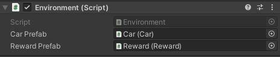
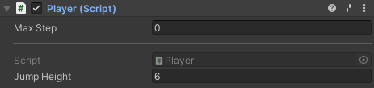
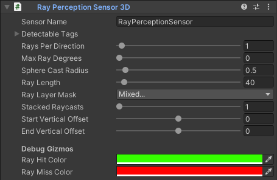
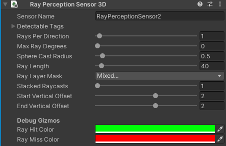
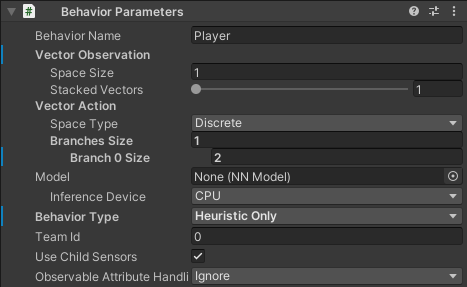
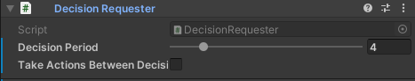
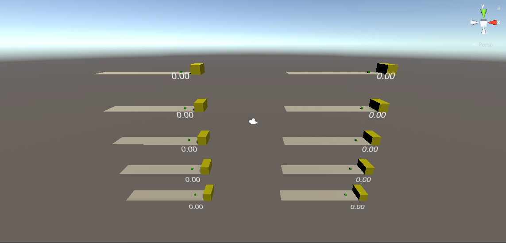
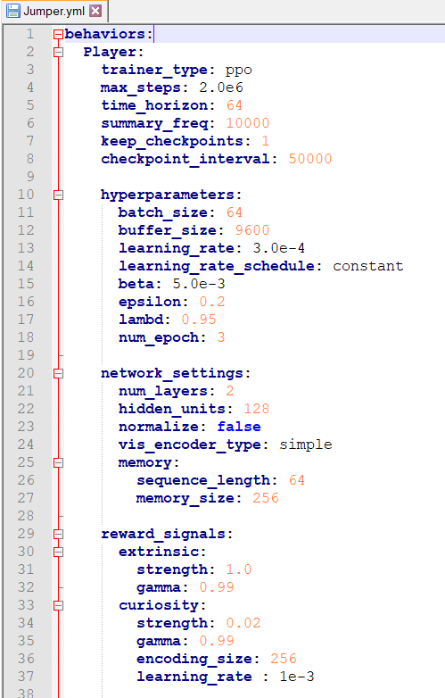

# Machine Learning Jumper Exercise Tutorial

## Inhoudsopgave

1. [Inleiding](#1-inleiding)
2. [Benodigdheden](#2-benodigdheden)
3. [Opzet](#3-opzet)
4. [Objecten](#4-objecten)
5. [Scripts](#5-scripts)
6. [Beloningsysteem](#6-beloningsysteem)
7. [Training](#7-training)

## 1. Inleiding

De jumper oefening bestaat uit een speler en auto's die op de speler komen afgereden. Het is de bedoeling dat de speler de auto's ontwijkt door te springen. Als de speler de auto aanraakt, krijgt hij minpunten. De speler wordt getraind om de auto's te ontwijken. De auto's hebben altijd een variabele snelheid. Dit zorgt ervoor dat het spel nog moeilijker wordt voor de speler. In deze tutorial wordt uitgelegd hoe dit project in elkaar zit. Alle objecten, scripts en instellingen worden beschreven. De tutorial legt uit hoe het mogelijk is om deze oefening te reproduceren. Het project en de documentatie is gemaakt door Bram Van Cronenburg en Kristof De Winter.

| Naam                | Studentnummer |
|:-------------------:|:-------------:|
| Kristof De Winter   | s106749       |
| Bram Van Cronenburg | s109544       |

## 2. Benodigdheden

De benodigde programma's om dit project te maken zijn [Visual Studio Community](https://visualstudio.microsoft.com/vs/community/) en [Unity](https://store.unity.com/download). Dit project is gemaakt in Unity versie 2019.4.12f1. Om de agent te trainen wordt [ML-Agents](https://github.com/Unity-Technologies/ml-agents/releases) gebruikt. De versie van ML-Agents die wordt gebruikt is 1.0.5.

[Python](https://www.python.org/downloads/) is vereist om de agent te laten trainen. De aanbevolen versie van Python is 3.8.1 of hoger. Het is optioneel om [Anaconda](https://www.anaconda.com/) of [Miniconda](https://docs.conda.io/en/latest/miniconda.html) te installeren, dit zorgt ervoor dat de training kan worden uitgevoerd in een afgezonderde omgeving.

## 3. Opzet


De rode kubus is de auto die de speler moet ontwijken. Deze auto heeft een variabele snelheid en kan enkel vooruit bewegen. De roze kubus is een reward, deze heeft dezelfde eigenschappen als een auto. Het verschil tussen een auto en een reward is dat de rewards punten geven en de auto's minpunten geven als de speler deze aanraakt.

De gele rechthoek is de object destroyer, deze zorgt ervoor dat de auto's en rewards die de speler niet raken verdwijnen. Het grijze vlak is de straat waar de speler en de auto opstaan. De speler krijgt punten zolang hij de straat aanraakt.

Het spawn object is een onzichtbaar object dat auto's en rewards kan genereren. Het scoreboard laat de cumulatieve score van een speler zien met een precisie van twee getallen na de komma. De groene kubus is de speler, de speler kan niet bewegen en kan enkel naar boven springen.

Het environment object bestaat uit:
- Car
- Reward
- Object destroyer
- Street
- SpawnObject
- Scoreboard
- Player

Environment groepeert alle objecten in één object. Dit maakt het gemakkelijker om meerdere environments paralel te laten trainen.

## 4. Objecten

#### 4.1 Environment

Het environment is een leeg object waar we alle andere objecten insteken. Dit object bevat het [Environment script](#51-Environment). We maken van environment een prefab, dit zorgt ervoor dat tijdens het trainen meerdere environments paralel kunnen trainen.

#### 4.2 Car

Het car object is een 3D cube met de tag "Car". Dit object bevat een Rigidbody, een material en het [Car script](#52-Car). De Rigidbody wordt gebruikt om ervoor te zorgen dat het object niet door de grond zakt.

#### 4.3 Reward

Het reward object is een 3D cube met de tag "Reward". Dit object bevat een Rigidbody, een material en het [Reward script](#53-Reward). In de Rigidbody wordt de Y-coordinaat vastgezet zodat de reward op dezelfde hoogte blijft vliegen.

#### 4.4 Object destroyer

De Object destroyer is een 3D cube die vergroot is. Dit object bevat de tag "ObjectDestroyer". Het bepaalt het einde van de straat, zodat de objecten niet van de straat vliegen. De Object Destroyer heeft ook een material meegekregen.

#### 4.5 Street

Het Street object is een 3D plane object met de tag "Street". Dit is de grond voor andere objecten op te plaatsen.

#### 4.6 SpawnObject

Het SpawnObject is een leeg 3D object. Dit object is een placeholder waarin cars en rewards worden gegenereerd.

#### 4.7 Scoreboard

Het Scoreboard object is een TextMeshPro object. Dit object toont de score tijdens het trainen.

#### 4.8 Player

Het Player object is het belangrijkste object van het project. Het bevat een rigidbody, een material en meerdere scripts. De meeste van deze scripts worden door ML Agents of Unity voorzien. Deze zijn de [RayPerception Sensor 3D](#55-RayPerception-Sensor-3D), de [Behavior Parameters](#56-Behavior-Parameters) en de [Decision Requester](#57-decision-requester). Het [RayPerception Sensor 3D](#55-RayPerception-Sensor-3D) script wordt twee maal gebruikt, zodat de speler op verschillende hoogtes objecten kan waarnemen. Het player object bevat ook het [Player](#54-Player) script.

## 5. Scripts

#### 5.1 Environment

Het Environment script zorgt ervoor dat cars en rewards worden gegenereerd. Dit script werkt het scoreboard bij en verwijdert cars en rewards die de object destroyer aanraken. Bij het genereren van rewards wordt er met een random generator gewerkt. De kans dat er een car wordt gegenereerd is 2/3. De kans dat er een Reward wordt gegenereerd is 1/3. Er worden meer cars gegeneerd dan rewards omdat het hoofddoel is dat de player leert om alle cars te ontwijken.

```csharp
public Car carPrefab;
public Reward rewardPrefab;
private Player player;
private TextMeshPro scoreBoard;
private GameObject spawnObject;
private readonly static System.Random random = new System.Random();

public void OnEnable()
{
    spawnObject = transform.Find("SpawnObject").gameObject;
    scoreBoard = transform.GetComponentInChildren<TextMeshPro>();
    player = transform.GetComponentInChildren<Player>();
}
```

Bovenaan worden de objecten geïnitialiseerd.
In de "OnEnable()" methode worden de variabelen opgevuld.

```csharp
private void FixedUpdate()
{
    scoreBoard.text = player.GetCumulativeReward().ToString("f2");
}
```

Deze methode zorgt ervoor dat het scoreboard voortdurend wordt bijgewerkt. In de "ToString()" methode wordt bepaalt dat er twee getallen na de komma worden getoond.

```csharp
public void ClearEnvironment()
{
    foreach (Transform _object in spawnObject.transform)
    {
        Destroy(_object.gameObject);
    }
}
```

De "ClearEnvironment()" methode zorgt ervoor dat alle bestaande gameobjecten verwijderd worden. Deze methode wordt aangeroepen wanneer de episode eindigt.

```csharp
public void SpawnObject()
{
    float randomObject = random.Next(1, 4);
    if (randomObject <= 2)
    {
        SpawnCar();
    }
    else
    {
        SpawnReward();
    }
}
```
De "SpawnObject()" methode bepaalt of er een car object of een reward object wordt gegenereerd. Er wordt een willekeurig getal gegeneerd, op basis van dit getal wordt er een car of een reward gegeneerd.

```csharp
public void SpawnCar()
{
    GameObject newCar = Instantiate(carPrefab.gameObject);

    newCar.transform.SetParent(spawnObject.transform);
    newCar.transform.localPosition = new Vector3(-18.5f, 0.5f);
}

public void SpawnReward()
{
    GameObject newReward = Instantiate(rewardPrefab.gameObject);

    newReward.transform.SetParent(spawnObject.transform);
    newReward.transform.localPosition = new Vector3(-18.5f, 2.5f);
}
```

Deze methodes zorgen ervoor dat er een nieuw car of reward wordt aangemaakt. De localposition bepaalt de positie van het gegenereerd object.



Bovenstaande afbeelding is de configuratie van het environment script in het environment object. Het is belangrijk dat de prefabs worden meegegeven, anders werkt het script niet.

#### 5.2 Car

Het car script zorgt ervoor dat een gegenereerde car een willekeurige snelheid krijgt. Dit script detecteert als er een botsing is met de ObjectDestroyer. Als dit het geval is wordt het environment gereset en wordt er een nieuw car object gegenereerd.

```csharp
private readonly static System.Random random = new System.Random();
private readonly float speed = random.Next(1, 100);
private Environment environment;

void Start()
{
    environment = GetComponentInParent<Environment>();
}

void Update()
{
    transform.position += new Vector3((100 + speed)/ 10, 0) * Time.deltaTime;
}
```

Bovenaan worden de objecten geïnitialiseerd. Er wordt een random variabele aangemaakt die gebruikt wordt om de snelheid van een car object te bepalen. Het environment object wordt meegegeven zodat deze kan gereset worden als de player tegen het car object botst. In de "Start()" methode wordt het environment object opgevuld. De "Update()" methode zorgt ervoor dat een car object kan blijven bewegen tegen een constante snelheid.

```csharp
private void OnCollisionEnter(Collision collision)
{
    if (collision.gameObject.CompareTag("ObjectDestroyer"))
    {
        environment.ClearEnvironment();
        environment.SpawnObject();
    }
}
```

In de "OnCollisionEnter()" methode wordt er een check uitgevoerd om te checken of er een botsing is tussen een speler en een car object. Als er zich een botsing voordoet wordt het environment gereset en wordt er een nieuw car object gegenereerd.

#### 5.3 Reward

Het reward script zorgt ervoor dat een gegenereerde reward een willekeurige snelheid krijgt. Dit script detecteert als er een botsing is met de ObjectDestroyer. Als dit het geval is wordt het environment gereset en wordt er een nieuw reward object gegenereerd.

```csharp
private readonly static System.Random random = new System.Random();
private readonly float speed = random.Next(1, 100);
private Environment environment;
void Start()
{
    environment = GetComponentInParent<Environment>();
}

void Update()
{
    transform.position += new Vector3((100 + speed) / 10, 0) * Time.deltaTime;
}
```

Bovenaan worden de objecten geïnitialiseerd. Er wordt een random variabele aangemaakt die gebruikt wordt om de snelheid van een reward object te bepalen. Het environment object wordt meegegeven zodat deze kan gereset worden als de player tegen het reward object botst. In de "Start()" methode wordt het environment object opgevuld. De "Update()" methode zorgt ervoor dat een reward object kan blijven bewegen tegen een constante snelheid.

```csharp
private void OnCollisionEnter(Collision collision)
{
    if (collision.gameObject.CompareTag("ObjectDestroyer"))
    {
        environment.ClearEnvironment();
        environment.SpawnObject();
    }
}
```

In de "OnCollisionEnter()" methode wordt er een check uitgevoerd om te checken of er een botsing is tussen een speler en een reward object. Als er zich een botsing voordoet wordt het environment gereset en wordt er een nieuw reward object gegenereerd.

#### 5.4 Player



het agent script

jump player

kijkt of hij kan jumpen

kijkt of/met welk objet hij collide

dat bij het begin van de episode het player object een juiste positie krijgt en de environment word klaargezet

collects observations

heuristic methode die ervoor zorgt dat we het handmattig kunnen testen

onActionRecieved die ervoor zorgt dat acties worden uitgevoerd tijdens het testen en tijdens het leren

```csharp
    public float jumpHeight = 6f;

    private bool canJump = true;
    private Rigidbody body;
    private Environment environment;
    private int carsHit;

    public override void Initialize()
    {
        base.Initialize();
        body = GetComponent<Rigidbody>();
        environment = GetComponentInParent<Environment>();
    }
```

Deze methode zorgt ervoor dat de speler kan jumpen. Eerst word er gecontroleerd of het mogelijk is voor de speler om te jumpen.

```csharp
    private void JumpPlayer()
    {
        if (canJump)
        {
            body.AddForce(new Vector3(0, jumpHeight, 0), ForceMode.VelocityChange);
            canJump = false;
        }
    }
```
In de FixedUpdate methode worden er punten gegeven als de player op de street staat en blijft staan. 

```csharp
    private void FixedUpdate()
    {
        Transform street = environment.transform.Find("Street");

        if (transform.position.y - street.position.y <= 1)
        {
            AddReward(0.001f);
        }
    }
```
De OnCollisionEnter zorgt ervoor dat als de player een ander object aanraakt er iets gebeurt. Bij het aanraken van het street object word ervoor gezord dat de player terug kan jumpen. Als hij het car object aanraakt dan zal de player minpunten krijgen. Na 5 keer een car object aan te raken zal de episode beëindigd worden. Als de player een reward object aanraakt zal de player pluspunten krijgen. Bij het aanraken van een car of reward object zal de environment gereset worden.

```csharp
    void OnCollisionEnter(Collision collision)
    {
        if (collision.gameObject.CompareTag("Street"))
            canJump = true;

        if (collision.gameObject.CompareTag("Car"))
        {
            AddReward(-1f);
            carsHit++;

            if (carsHit >= 5)
                EndEpisode();
            else
            {
                environment.ClearEnvironment();
                environment.SpawnObject();
            }
        }

        if (collision.gameObject.CompareTag("Reward"))
        {
            AddReward(1f);
            environment.ClearEnvironment();
            environment.SpawnObject();
        }
    }
```
Deze methode word aangeroepen bij het begin van een episode. Ze zorgt ervoor dat de positie van de player correct is en dat de environment word geladen. Hier word ook het aantal aangeraakte cars terug op 0 gezet zodat de telling opnieuw kan beginnen.

```csharp
    public override void OnEpisodeBegin()
    {
        transform.localPosition = new Vector3(22f, 0.5f, 0f);

        body.angularVelocity = Vector3.zero;
        body.velocity = Vector3.zero;

        environment.ClearEnvironment();
        environment.SpawnObject();

        carsHit = 0;
    }
```

```csharp
    public override void CollectObservations(VectorSensor sensor)
    {
    }
```

```csharp
    public override void Heuristic(float[] actionsOut)
    {
        actionsOut[0] = 0;

        if (Input.GetKey(KeyCode.Space))
        {
            actionsOut[0] = 1;
        }
    }
```

```csharp
    public override void OnActionReceived(float[] vectorAction)
    {
        if (vectorAction[0] == 0)
        {
            return;
        }

        if (vectorAction[0] != 0)
        {
            JumpPlayer();
        }
    }
```

#### 5.5 RayPerception Sensor 3D

Zoals eerder gezegd werken we met 2 verschillende RayPersception sensors dit omdat de objectem car en reward niet door dezelfde RayPerception sensor gezien kunnen worden. De eerste RayPerception sensor is zo ingesteld dat hij maar 1 ray heeft die vooruit kijkt met een lengte van 40. De tweede RayPerception sensor is hetzelfde ingesteld alleen krijgt deze een Start en End vertical offset van 2. Hierdoor kan de eerste RayPerception sensor het Car object zien en de tweede het Reward object.





#### 5.6 Behavior Parameters

Door Behavior Type aan te passen naar Heuristic Only kan er handmattig getest worden. Door dit aan te passen naar Default kan er samen met ML Agents geleert worden. Als er in model een brein word gestoken kan er ook vanuit dit brein verder geleerd worden. Hiermee kan ook gekeken worden wat het brein al kan zonder verder te leren.



#### 5.7 Decision Requester



## 6. Beloningsysteem

Het belongingsysteem is 1 van de belangrijkste componenten van het leerproces. Dit omdat uit deze belongingen de agent gaat leren. We hebben ervoor gekozen om de agent punten te geven om te blijven stilstaan. Dit om het niet continu springen af te raden. Ook krijgt de agent punten als hij een reward oppakt. De agent zal punten verliezen als hij geraakt word door een car.

## 7. Training

Voordat we beginnen met het trainen moet er nog een Learning map toegevoegd worden aan het project. In deze map zetten we ook nog een yml file. Deze file is de configuratie van het leren. Hiernaast komt ook nog een Results map waar de resultaten van het leren in terecht komen.

Om een leer omgeving op te zetten open je een cmd in de map Learning en geef je dit comando in:

mlagents-learn Jumper.yml --run-id Jumper-01

Het neemt de yml file Jumper voor de configuratie en maakt in de Results map het resultaat aan in de map Jumper-01. Om een tweede leer omgeving aan te maken moet de Jumper-01 aangepast worden naar bijvoorbeeld Jumper-02.

Om de resultaten van het leerproces gemakkelijk te kunnen bekijken open je een cmd in de map Learning en geef je dit comando in:

tensorboard --logdir results

Dit opent op localhost:6006 een tensorboard. Hierop zijn de resultaten van het leerproces duidelijk te zien.



